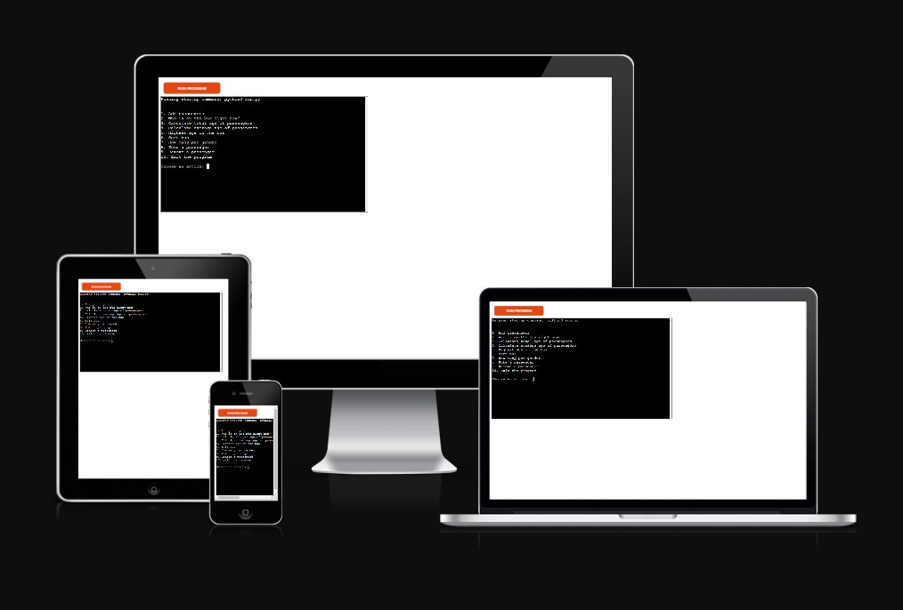
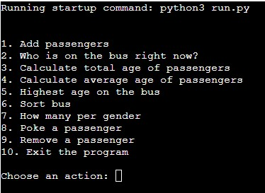
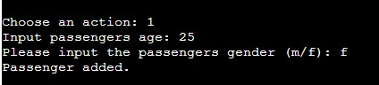
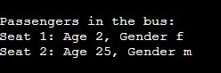
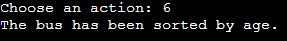
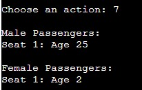
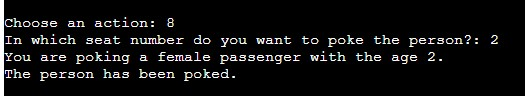
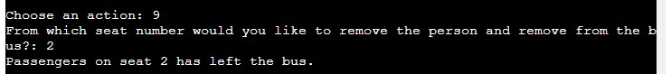
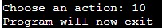

# Bus Management System

This Python-based command-line program simulates a bus management system. The program allows users to manage passengers on a bus by performing various actions.




## Table of Contents
- [Usage](#usage)
- [Objectives of the Project](#objectives-of-the-project)
- [User Stories](#user-stories)
- [Testing](#testing)
  - [Overview](#overview)
  - [Test Cases](#test-cases)
  - [Testing Write-Ups](#testing-write-ups)
  - [Tools Used](#tools-used)
  - [Test Results](#test-results)
  - [Bugs Occurred During Development](#bugs-occurred-during-development)
- [Deployment](#deployment)
- [Libraries Used and Rationale](#libraries-used-and-rationale)
- [Screenshots](#screenshots)

## Usage

- **Add Passengers:** Add passengers to the bus by entering their age and gender.
- **View Passenger List:** Display the list of passengers currently on the bus.
- **Calculate Total Age:** Calculate the total age of all passengers on the bus.
- **Calculate Average Age:** Calculate the average age of passengers on the bus.
- **Find Oldest Passenger:** Identify the oldest passenger on the bus.
- **Filter Passengers by Age:** Find passengers within a specific age range.
- **Sort Passengers:** Sort the list of passengers by age in descending order.
- **View Gender Count:** Display the count of passengers based on gender.
- **Poke and Remove Passengers:** Interactively poke or remove passengers from their seat.


### Objectives of the Project
The Bus Management System is designed to streamline the process of managing bus passengers and related operations. Its primary objectives are:
- To efficiently manage a list of passengers aboard a bus, including their ages and genders.
- To provide a user-friendly interface for adding, removing, and interacting with passengers.
- To perform various operations such as calculating the total and average age of passengers, finding the highest age, and sorting passengers based on age.
- To enhance the user's ability to manage bus capacities and ensure equitable service.

---
I am fully aware that a bus management system might not have much real world application, but for the sake of the project I found it reasonable. For more real world application we could just change the fact that its a bus to for example a prison, where a system for having full control and ability to overview the inmates is important. 


### User Stories
- **As a bus operator** , I want to add passengers to the bus so that I can keep track of who is on board
- **As a bus operator**, I need to be able to remove passengers from the list when they get off the bus to maintain an accurate count.
- **As a manager**, I want to calculate the total and average age of passengers to understand the demographic makeup of my service users.
- **As a manager**, I wish to sort passengers by age and gender for targeted services and promotions.
- **As a passenger**, I want the operator to have a simple way to manage the bus so that the service runs smoothly and efficiently.

## Testing

### Overview

The Bus Management System underwent testing to ensure functionality and responsiveness across different user interactions.

### Test Cases

- **Functionality**: Verified all features (adding passengers, data calculations, sorting, and removing passengers) for accuracy and expected behavior.
- **Interface Testing**: Ensured a user-friendly interface and ease of use during passenger management operations.
- **Input Validation**: Checked for appropriate handling of user inputs, including age and gender entries.
- **Compatibility Testing**: Confirmed compatibility across different environments and systems.


### Testing Write-Ups
Testing focused on ensuring the reliability of passenger management functions, including adding, removing, and interacting with passengers. Test cases were developed to validate:
- The addition of passengers and error handling for a full bus.
- Accurate calculations for total and average ages, and the ability to find the highest age.
- Sorting functionality and gender-based passenger counts.
- Edge cases for user inputs, such as invalid age or gender, and ensuring robustness against such errors.
  
Automated tests were written to simulate various scenarios, ensuring the system behaves as expected under different conditions.

### Tools Used

- **Manual Testing**: Conducted various manual tests to assess user interactions and functionality.
- **Code Institute Python Linter**: Utilized CI Python PEP8 Linter automated testing. 
- **Systematic Testing**: Employed systematic methods to ensure comprehensive coverage of all functionalities.

- PEP8 Result
  


### Test Results

The project passed all test cases, showcasing consistent performance and accurate functionality across various scenarios.

### Bugs Occured During Development
During the development i stumbled upon various bugs, but throught perseverence I learned a lot from rewatching the learning material provided aswell as looking through various coding forums for ideas to solve my issues. 

####  Bugs I Encountered
- **Infinite Loop on Incorrect Input:** If the user enters an invalid input (not a number where a number is expected), it could cause an infinite loop if the input validation is not properly handled within the while loops, leading to repeated prompts or crashes. This was fixed by adding input validation.
- **Input Validation Loops Not Exiting Properly:** When incorrect input is provided, the program is supposed to prompt the user again until a valid input is given. However, if the loop control mechanism is not correctly implemented, the program might either exit prematurely or enter an infinite loop, continuously asking for input.
- **Placement And Enumeration Not Corresponding:** When having for example 5 persons on the bus, asking the bus for the age of number 3 the program responded with the information of nr 2 or 4 instead of 3. This was fixed by adding ```f"Seat {i + 1``` and similar. I later learned the cause of the issue being the starting point of counting in python.
- **Case Sensitivity in Gender Input:** I noticed that the system was case-sensitive when processing gender inputs, leading to valid inputs in uppercase ("M" or "F") being rejected. To solve this, I modified the input handling to convert all gender inputs to lowercase before processing, eliminating the case sensitivity issue. ```"Please input the passengers gender (m/f): ").lower() ```


## Deployment


The Bus Management System was developed locally and deployed using Heroku. Follow the link to test the [Bus Management System](https://bus-python-39d4b2ee8d3d.herokuapp.com/).

The deployed Bus Management System code can be accessed via the following link: [GitHub](https://github.com/augustsletto/bus-python)


This guide will take you through deploying the Bus Management System to Heroku. Before starting, ensure you have a Heroku account and have installed both Git and the Heroku CLI on your computer.

- **Step 1: Obtain the Project**
  
First, you need to get a copy of the Bus Management System project. You can do this by forking the project repository on GitHub if you wish to make changes or directly cloning it if you just want to deploy it as-is.

Forking (optional): Go to the GitHub page for the project, click the "Fork" button at the top right to create your own copy of the project in your GitHub account.
Cloning: Clone the project to your local machine. If you've forked the project, replace augustsletto with your GitHub username in the URL.
```
git clone https://github.com/augustsletto/bus-python.git
```
```
cd bus-python
```
- **Step 2: Prepare Your Local Copy**
After cloning the project, navigate into the project directory. If not already present, create a requirements.txt file listing all dependencies:
```
pip freeze > requirements.txt
```
Create a Procfile to tell Heroku how to run your application. Open a text editor and add the following line:
```
worker: python run.py
```
Save this as Procfile in the root directory of your project.

- **Step 3: Initialize Git**
If the project isn't already a Git repository, initialize one:
```
git init
git add .
git commit -m "Prepare for Heroku deployment"
```
- **Step 4: Create a Heroku App**
Log in to Heroku through the CLI and create a new app:
```
heroku login
heroku create
```
This command creates a new app on Heroku and adds a remote to your local Git repository.

- **Step 5: Deploy the Application**
Deploy your code to Heroku:
```
git push heroku master
```
Or if your main branch is named main, use:
```
git push heroku main
```
- **Step 6: Manage Dynos**
By default, Heroku starts a web dyno. You need to change this since your application uses a worker dyno:
```
heroku ps:scale web=0 worker=1
```

- **Deploying from the Heroku Dashboard**
Open Heroku Dashboard and go to Heroku Dashboard in your web browser and log in with your Heroku credentials.

Find the application you created in the list of your Heroku apps and click on it to open the app’s dashboard.

Navigate to the 'Deploy' Section in the app’s dashboard, you will find a navigation bar at the top. Click on the "Deploy" tab to go to the deployment section.

Connect to GitHub if you haven’t connected your Heroku app to a GitHub repository yet, you can do so in the "Deployment method" section. Click on "Connect to GitHub", search for your repository, and then click "Connect" next to the repo you want to deploy.

Manual Deploy: Scroll down to the "Manual deploy" section. If you’ve connected your GitHub repository, select the branch you want to deploy from the dropdown menu and then click "Deploy Branch".

Monitor Deployment: Heroku will begin the deployment process. You can monitor the progress directly on the page. It will display build logs and notify you once the deployment is successful.


## Libraries Used and Rationale

The Bus Management System utilizes both Python and Node.js environments, integrating technologies for a robust command-line application. Here's the rationale behind the selected libraries and tools:

### Python
- **Python 3.9.18**: Chosen for its reliability and wide support. Python's extensive standard library allows for efficient development of the core functionalities without external dependencies, making the system lightweight and easy to maintain.

### Node.js
- **Node.js Libraries**:
  - **node-static**: Serves static files required by the application. It's lightweight and provides an efficient way to serve files, enhancing the performance.
  - **node-pty**: Enables the application to run and manage terminal processes. It's crucial for simulating the command-line interface within the web application.
  - **total4**: A modern framework for Node.js, used for its simplicity and performance in building web applications. It allows for quick development and easy deployment of web services.

These selections provide a balance between performance, ease of use, and functionality, ensuring a seamless user experience in a command-line simulation environment.


## Screenshots

Include relevant screenshots showcasing the command-line interface and functionalities of the Bus Management System.



















